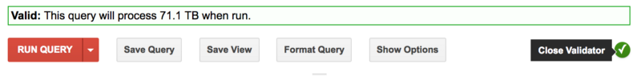
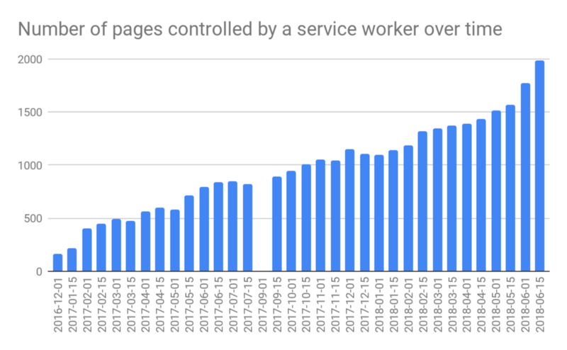
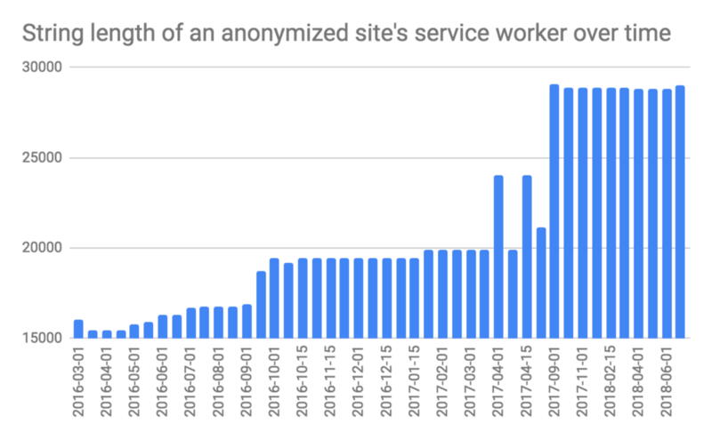

Thomas Steiner, Google Hamburg, Germany

📧 [tomac@google.com](mailto:tomac@google.com) • 🐦 [@tomayac](https://twitter.com/tomayac) • 😸 [tomayac](https://github.com/tomayac)

(Originally published on my blog: [https://blog.tomayac.com/2018/07/09/progressive-web-apps-in-the-http-archive-143748](https://blog.tomayac.com/2018/07/09/progressive-web-apps-in-the-http-archive-143748).)

### Abstract

_In this document, we present three different approaches and discuss their particular pros and cons for extracting data about Progressive Web Apps (PWA) from the HTTP Archive. Approach 1 is based on data that is tracked in the context of runs of the Lighthouse tool, Approach 2 is based on use counters in the Chrome browser to record per-page anonymous aggregated metrics on feature usage, and Approach 3 is based on parsing the source code of web pages for traces of service worker registrations and Web App Manifest references. We find that by all three approaches the popularity of PWAs increases roughly linearly over time and provide further research ideas based on the extracted data, whose underlying queries we share publicly._

### Introduction to Progressive Web Apps

Progressive Web Apps (PWA) are a new class of web applications, enabled for the most part by the [Service Worker APIs](https://developer.mozilla.org/en/docs/Web/API/Service_Worker_API). Service workers allow apps to support _network-independent loading_ by intercepting network requests to deliver programmatic or cached responses, service workers can receive _push notifications_ and _synchronize_ data in the background even when the corresponding app is not running, and service workers — together with [Web App Manifests](https://developer.mozilla.org/en-US/docs/Web/Manifest) — allow users to _install_ PWAs to their devices’ home screens. Service workers were [first implemented in Chrome 40 Beta](https://blog.chromium.org/2014/12/chrome-40-beta-powerful-offline-and.html) released in December 2014, and the term _Progressive Web Apps_ was [coined by Frances Berriman and Alex Russell](https://infrequently.org/2015/06/progressive-apps-escaping-tabs-without-losing-our-soul/) in 2015.

### Research Questions and Problem Statement

As service workers are now finally [implemented in all major browsers](https://jakearchibald.github.io/isserviceworkerready/), we at the Google Web Developer Relations team were wondering _“how many PWAs are actually out there in the wild and how do they make use of these new technologies?”_ Certain advanced APIs like [Background Sync](https://developers.google.com/web/updates/2015/12/background-sync) are currently still [only available on Chromium-based browsers](https://caniuse.com/#feat=background-sync), so as an additional question we looked into _“what features do these PWAs actually use — or in the sense of progressive enhancement — try to use?”_ Our first idea was to check some of the curated PWA catalogues, for example, [PWA.rocks](https://pwa.rocks/), [PWA Directory](https://pwa-directory.appspot.com/), [Outweb](https://outweb.io/), or [PWA Stats](https://www.pwastats.com/). The problem with such catalogues is that they suffer from what we call _submission bias_. [Anecdotal](https://outweb.io/1506520224205) [evidence](https://www.pwastats.com/2017/06/forbes/) [shows](https://pwa-directory.appspot.com/pwas/5758305695694848) that authors of PWAs want to be included in as many catalogues as possible, but oftentimes the listed examples are not very representative of _the_ web and rather longtail. For example, at the time of writing, the [first listed PWA](https://pwa-directory.appspot.com/pwas/4816176644358144) on _PWA Directory_ is [feuerwehr-eisolzried.de](https://feuerwehr-eisolzried.de/), a PWA on the _“latest news, dates and more from \[the\] fire department in Eisolzried, Bavaria.”_ Second, while _PWA Stats_ offers tags, for example, on the [use of notifications](https://www.pwastats.com/tags/notifications), not all PWA features are classified in their tagging system. In short, PWA catalogues are not very well suited for answering our research questions.

### The HTTP Archive to the Rescue

The [HTTP Archive](https://httparchive.org/) tracks how the web is built and provides historical data to quantitatively illustrate how the web is evolving. The archive’s crawlers process [500,000 URLs](https://httparchive.org/faq#how-does-the-http-archive-decide-which-urls-to-test) for both desktop and mobile twice a month. These URLs come from the most popular 500,000 sites in the [Alexa Top 1,000,000](http://www.alexa.com/topsites) list and are mostly homepages that may or may not be representative for the rest of the site. The data in the HTTP Archive can be [queried through BigQuery](https://github.com/HTTPArchive/legacy.httparchive.org/blob/master/docs/bigquery-gettingstarted.md), where multiple tables are available in the `httparchive` project. As these tables tend to get fairly big, they are partitioned, but multiple associated tables can be queried using the [wildcard symbol '\*'](https://cloud.google.com/bigquery/docs/querying-wildcard-tables). For our purposes, three families of tables are relevant, leading to three different approaches:

*   `httparchive.lighthouse.*`, which contains data about [Lighthouse](https://developers.google.com/web/tools/lighthouse/) runs.
*   `httparchive.pages.*`, which contain the JSON-encoded parent documents’ [HAR](https://w3c.github.io/web-performance/specs/HAR/Overview.html) data.
*   `httparchive.response_bodies.*`, which contains the raw response bodies of all resources and sub-resources of all sites in the archive.

In the following, we will discuss all three approaches and their particular pros and cons, as well as present the extractable data and ideas for further research. All [queries are also available on GitHub](https://github.com/tomayac/http-archive-progressive-web-apps) and are released under the terms of the Apache 2.0 license.

⚠️ Warning: while BigQuery grants everyone a certain amount of [free quota per month](https://cloud.google.com/bigquery/pricing#free), on-demand pricing kicks in once the free quota is consumed. Currently, this is [$5 per terabyte](https://cloud.google.com/bigquery/pricing#on_demand_pricing). Some of the shown queries process 70+(!) terabytes! You can see the amount of data that will be processed by clicking on the _Validator_ icon:

### Approach 1: `httparchive.lighthouse.*` Tables

### Description

[Lighthouse](https://developers.google.com/web/tools/lighthouse/) is an automated open-source tool for improving the quality of web pages. One can run it against any web page, public or requiring authentication. It has audits for _Performance_, _Accessibility_, _Progressive Web App_, and more. The `httparchive.lighthouse.*` tables contain JSON dumps ([example](https://gist.github.com/tomayac/05fed2d4bfa94fe066c705510a3c2103)) of past reports that can be extracted via BigQuery.

### Cons

The biggest con is that obviously the tables only contain data of web pages that were ever run through the tool, so there is a blind spot. Additionally, while latest versions of Lighthouse process mobile _and_ desktop pages, the currently used Lighthouse only processes mobile pages, so there are no results for desktop. One pitfall when working with these tables is that in a past version of Lighthouse _Progressive Web App_ was the first category that was shown in the tool, however the [order was flipped](https://github.com/GoogleChrome/lighthouse/issues/3599) in the current version so that now _Performance_ is first. In the query we need to take this corner case into account.

### Pros

On the positive side, Lighthouse has clear scoring guidelines based on the [Baseline PWA Checklist](https://developers.google.com/web/progressive-web-apps/checklist#baseline) for each version of the tool ([v2](https://developers.google.com/web/tools/lighthouse/scoring#pwa), [v3](https://developers.google.com/web/tools/lighthouse/v3/scoring#pwa)), so by requiring a minimum _Progressive Web App_ score of ≥75, we can, to some extent, determine what PWA features we want to have included, namely, we can require offline capabilities and make sure the app can be added to the home screen.

### Query and Results

Running the query below and then selecting distinct PWA URLs returns [799 unique PWA results](https://docs.google.com/spreadsheets/d/1zxpfuEW06oG6wXWq96Zrs0FjzDVVDUTpRcNu9TkiyIw/edit?usp=sharing) that are known to work offline and to be installable to the user’s home screen.

#standardSQL  
CREATE TEMPORARY FUNCTION  
  getPWAScore(report STRING)  
  RETURNS FLOAT64  
  LANGUAGE js AS """  
$=JSON.parse(report);  
return $.reportCategories.find(i => i.name === 'Progressive Web App').score;  
""";  
CREATE TABLE IF NOT EXISTS  
  \`progressive\_web\_apps.lighthouse\_pwas\` AS  
SELECT  
  DISTINCT url AS pwa\_url,  
  IFNULL(rank,  
    1000000) AS rank,  
  date,  
  platform,  
  CAST(ROUND(score) AS INT64) AS lighthouse\_pwa\_score  
FROM (  
  SELECT  
    REGEXP\_REPLACE(JSON\_EXTRACT(report,  
        "$.url"), "\\"", "") AS url,  
    getPWAScore(report) AS score,  
    REGEXP\_REPLACE(REGEXP\_EXTRACT(\_TABLE\_SUFFIX, "\\\\d{4}(?:\_\\\\d{2}){2}"), "\_", "-") AS date,  
    REGEXP\_EXTRACT(\_TABLE\_SUFFIX, ".\*\_(\\\\w+)$") AS platform  
  FROM  
    \`httparchive.lighthouse.\*\`  
  WHERE  
    report IS NOT NULL  
    AND JSON\_EXTRACT(report,  
      "$.audits.service-worker.score") = 'true' )  
LEFT JOIN (  
  SELECT  
    Alexa\_rank AS rank,  
    Alexa\_domain AS domain  
  FROM  
    # Hard-coded due to [https://github.com/HTTPArchive/bigquery/issues/42](https://github.com/HTTPArchive/bigquery/issues/42)  
    \`httparchive.urls.20170315\`  
  WHERE  
    Alexa\_rank IS NOT NULL  
    AND Alexa\_domain IS NOT NULL ) AS urls  
ON  
  urls.domain = NET.REG\_DOMAIN(url)  
WHERE  
  # Lighthouse "Good" threshold  
  score >= 75  
GROUP BY  
  url,  
  date,  
  score,  
  platform,  
  date,  
  rank  
ORDER BY  
  rank ASC,  
  url,  
  date DESC;

### Research Ideas

An interesting analysis we can run based on this data is the development of average Lighthouse PWA scores over time and the number of PWAs (note that the presented naive approach does not take the in relation also growing HTTP Archive into account, but purely counts absolute numbers).

#standardSQL  
SELECT  
  date,  
  count (DISTINCT pwa\_url) AS total\_pwas,  
  round(AVG(lighthouse\_pwa\_score), 1) AS avg\_lighthouse\_pwa\_score  
FROM  
  \`progressive\_web\_apps.lighthouse\_pwas\`  
GROUP BY  
  date  
ORDER BY  
  date;

### Approach 2: `httparchive.pages.*` Tables

### Description

Another straightforward way for estimating the amount of PWAs (however completely neglecting Web App Manifests) is to look for so-called [use counters](https://cs.chromium.org/chromium/src/third_party/blink/public/platform/web_feature.mojom) in the `httparchive.pages.*` tables. Particularly interesting is the `ServiceWorkerControlledPage` use counter, which, [according to Chrome engineer Matt Falkenhagen](https://groups.google.com/a/chromium.org/d/msg/blink-api-owners-discuss/uxwEuxCRfGA/_1VdL4_EBAAJ), _“is counted whenever a page is controlled by a service worker, which typically happens only on subsequent loads.”_

### Cons

No qualitative attributes other than the absolute fact that a service worker controlled the loading of the page can be extracted. More importantly, as the counter is typically triggered on subsequent loads only (and not on the first load that the crawler sees), this method undercounts and only contains sites that claim their clients (`self.clients.claim()`) on the first load.

### Pros

On the bright side, the precision is high due to the browser-level tracking, so we can be sure the page actually registered a service worker. The query also covers both desktop and mobile.

### Query and Results

This approach, at time of writing, turns up [5,368 unique results](https://docs.google.com/spreadsheets/d/16jJQF4ACqOKnypCC1jqUqpC3mO-guBZAaSA-P9tbJJg/edit?usp=sharing), however, as mentioned before, not all of these results _necessarily_ qualify as PWA due to the potentially missing Web App Manifest that affects the installability of the app.

#standardSQL  
CREATE TABLE IF NOT EXISTS  
  \`progressive\_web\_apps.usecounters\_pwas\` AS  
SELECT  
  DISTINCT REGEXP\_REPLACE(url, "^http:", "https:") AS pwa\_url,  
  IFNULL(rank,  
    1000000) AS rank,  
  date,  
  platform  
FROM (  
  SELECT  
    DISTINCT url,  
    REGEXP\_REPLACE(REGEXP\_EXTRACT(\_TABLE\_SUFFIX, "\\\\d{4}(?:\_\\\\d{2}){2}"), "\_", "-") AS date,  
    REGEXP\_EXTRACT(\_TABLE\_SUFFIX, ".\*\_(\\\\w+)$") AS platform  
  FROM  
    \`httparchive.pages.\*\`  
  WHERE  
    # From [https://cs.chromium.org/chromium/src/third\_party/blink/public/platform/web\_feature.mojom](https://cs.chromium.org/chromium/src/third_party/blink/public/platform/web_feature.mojom)  
    JSON\_EXTRACT(payload,  
      '$.\_blinkFeatureFirstUsed.Features.ServiceWorkerControlledPage') IS NOT NULL)  
LEFT JOIN (  
  SELECT  
    Alexa\_domain AS domain,  
    Alexa\_rank AS rank  
  FROM  
    # Hard-coded due to [https://github.com/HTTPArchive/bigquery/issues/42](https://github.com/HTTPArchive/bigquery/issues/42)  
    \`httparchive.urls.20170315\` AS urls  
  WHERE  
    Alexa\_rank IS NOT NULL  
    AND Alexa\_domain IS NOT NULL )  
ON  
  domain = NET.REG\_DOMAIN(url)  
ORDER BY  
  rank ASC,  
  date DESC,  
  pwa\_url;

### Research Ideas

Similar to the second query in _Approach 1_ from above, we can also track the number of pages controlled by a service worker over time (the gap in the September 1, 2017 dataset is due to a parsing issue in the data collection pipeline).

#standardSQL  
SELECT  
  date,  
  count (DISTINCT pwa\_url) AS total\_pwas  
FROM  
  \`progressive\_web\_apps.usecounters\_pwas\`  
GROUP BY  
  date  
ORDER BY  
  date;

### Approach 3: `httparchive.response_body.*` Tables

### Description

A third less obvious way to answer our research questions is to look at actual response bodies. The `httparchive.response_bodies.*` tables contain raw data of all resources and sub-resources of all sites in the archive, so we can use fulltext search to find patterns that are indicators for the presence of PWA features like, for instance, the existence of variations of the string `navigator.serviceWorker.register("` that provide a clue that the page might be registering a service worker on the one hand, and variations of `<link rel="manifest"` that point to a potential Web App Manifest on the other hand.

### Cons

The downside of this approach is that we are trying to parse HTML with regular expressions to begin with, which is [commonly known to be impossible](https://stackoverflow.com/a/1732454) and a [bad practice](https://www.reddit.com/r/ProgrammerHumor/comments/6ytfw5/parsing_html_using_regular_expressions/). One example where things can go wrong is that we might detect out-commented code or struggle with incorrectly nested code.

### Pros

Despite all challenges, as the service worker JavaScript files and the Web App Manifest JSON files are subresources of the page and therefore stored in the `httparchive.response_bodies.*` tables, we can still bravely attempt to examine their contents and try to gain an in-depth understanding of the PWAs’ capabilities. By checking the service worker JavaScript code for the events the service worker listens to, we can see if a PWA—at least in theory—deals with Web Push notifications, handles fetches, _etc._, and by looking at the Web App Manifest JSON document, we can see if the PWA specifies a start URL, provides a name, and so on.

### Query and Results

We have split the analysis of service workers and Web App Manifests, and use a common helper table to extract PWA candidates from the large response body tables. As references to service worker script files and Web App Manifest JSON files may be relative or absolute, we need a [User-Defined Function](https://cloud.google.com/bigquery/docs/reference/standard-sql/user-defined-functions) to resolve paths like `../../manifest.json` relative to their base URL. Our function is a hacky simplification based on [path.resolve(\[...paths\])](https://nodejs.org/docs/latest/api/path.html#path_path_resolve_paths) in Node.js and not very elegant. We deliberately ignore references that would require executing JavaScript, for example, URLs like `window.location.href + 'sw.js'`, so our regular expressions are a bit involved to make sure we exclude these cases.

#### PWA Candidates Helper Table

#standardSQL  
CREATE TEMPORARY FUNCTION  
  pathResolve(path1 STRING,  
    path2 STRING)  
  RETURNS STRING  
  LANGUAGE js AS """  
  function normalizeStringPosix(e,t){for(var n="",r=-1,i=0,l=void 0,o=!1,h=0;h<=e.length;++h){if(h<e.length)l=e.charCodeAt(h);else{if(l===SLASH)break;l=SLASH}if(l===SLASH){if(r===h-1||1===i);else if(r!==h-1&&2===i){if(n.length<2||!o||n.charCodeAt(n.length-1)!==DOT||n.charCodeAt(n.length-2)!==DOT)if(n.length>2){for(var g=n.length-1,a=g;a>=0&&n.charCodeAt(a)!==SLASH;--a);if(a!==g){n=-1===a?"":n.slice(0,a),r=h,i=0,o=!1;continue}}else if(2===n.length||1===n.length){n="",r=h,i=0,o=!1;continue}t&&(n.length>0?n+="/..":n="..",o=!0)}else{var f=e.slice(r+1,h);n.length>0?n+="/"+f:n=f,o=!1}r=h,i=0}else l===DOT&&-1!==i?++i:i=-1}return n}function resolvePath(){for(var e=\[\],t=0;t<arguments.length;t++)e\[t\]=arguments\[t\];for(var n="",r=!1,i=void 0,l=e.length-1;l>=-1&&!r;l--){var o=void 0;l>=0?o=e\[l\]:(void 0===i&&(i=getCWD()),o=i),0!==o.length&&(n=o+"/"+n,r=o.charCodeAt(0)===SLASH)}return n=normalizeStringPosix(n,!r),r?"/"+n:n.length>0?n:"."}var SLASH=47,DOT=46,getCWD=function(){return""};if(/^https?:/.test(path2)){return path2;}if(/^\\\\//.test(path2)){return path1+path2.substr(1);}return resolvePath(path1, path2).replace(/^(https?:\\\\/)/, '$1/');  
""";  
CREATE TABLE IF NOT EXISTS  
  \`progressive\_web\_apps.pwa\_candidates\` AS  
SELECT  
  DISTINCT REGEXP\_REPLACE(page, "^http:", "https:") AS pwa\_url,  
  IFNULL(rank,  
    1000000) AS rank,  
  pathResolve(REGEXP\_REPLACE(page, "^http:", "https:"),  
    REGEXP\_EXTRACT(body, "navigator\\\\.serviceWorker\\\\.register\\\\s\*\\\\(\\\\s\*\[\\"'\](\[^\\\\),\\\\s\\"'\]+)")) AS sw\_url,  
  pathResolve(REGEXP\_REPLACE(page, "^http:", "https:"),  
    REGEXP\_EXTRACT(REGEXP\_EXTRACT(body, "(<link\[^>\]+rel=\[\\"'\]?manifest\[\\"'\]?\[^>\]+>)"), "href=\[\\"'\]?(\[^\\\\s\\"'>\]+)\[\\"'\]?")) AS manifest\_url  
FROM  
  \`httparchive.response\_bodies.\*\`  
LEFT JOIN (  
  SELECT  
    Alexa\_domain AS domain,  
    Alexa\_rank AS rank  
  FROM  
    # Hard-coded due to [https://github.com/HTTPArchive/bigquery/issues/42](https://github.com/HTTPArchive/bigquery/issues/42)  
    \`httparchive.urls.20170315\` AS urls  
  WHERE  
    Alexa\_rank IS NOT NULL  
    AND Alexa\_domain IS NOT NULL )  
ON  
  domain = NET.REG\_DOMAIN(page)  
WHERE  
  (REGEXP\_EXTRACT(body, "navigator\\\\.serviceWorker\\\\.register\\\\s\*\\\\(\\\\s\*\[\\"'\](\[^\\\\),\\\\s\\"'\]+)") IS NOT NULL  
    AND REGEXP\_EXTRACT(body, "navigator\\\\.serviceWorker\\\\.register\\\\s\*\\\\(\\\\s\*\[\\"'\](\[^\\\\),\\\\s\\"'\]+)") != "/")  
  AND (REGEXP\_EXTRACT(REGEXP\_EXTRACT(body, "(<link\[^>\]+rel=\[\\"'\]?manifest\[\\"'\]?\[^>\]+>)"), "href=\[\\"'\]?(\[^\\\\s\\"'>\]+)\[\\"'\]?") IS NOT NULL  
    AND REGEXP\_EXTRACT(REGEXP\_EXTRACT(body, "(<link\[^>\]+rel=\[\\"'\]?manifest\[\\"'\]?\[^>\]+>)"), "href=\[\\"'\]?(\[^\\\\s\\"'>\]+)\[\\"'\]?") != "/")  
ORDER BY  
  rank ASC,  
  pwa\_url;

#### Web App Manifests Analysis

Based on this helper table, we can then run the analysis of the Web App Manifests. We check for the existence of properties defined in the `[WebAppManifest](https://www.w3.org/TR/appmanifest/#webappmanifest-dictionary)` [dictionary](https://www.w3.org/TR/appmanifest/#webappmanifest-dictionary) combined with non-standard, but well-known properties like `"gcm_sender_id"` from the deprecated [Google Cloud Messaging](https://developers.google.com/cloud-messaging/) or `"share_target"` from the currently [in flux Web Share Target API](https://wicg.github.io/web-share-target/#extension-to-the-web-app-manifest). Turns out, not many manifests are in the archive; from 2,823 candidate manifest URLs in the helper table we actually only find [30 unique Web App Manifests](https://docs.google.com/spreadsheets/d/1VE9hoj7Ag7E3kOG4BKc8NKISg1w0BZVQkGdCq4MJ6hw/edit?usp=sharing) and thus PWAs in the response bodies, but these at least archived in several versions.

#standardSQL  
  CREATE TABLE IF NOT EXISTS \`progressive\_web\_apps.web\_app\_manifests\` AS  
SELECT  
  pwa\_url,  
  rank,  
  manifest\_url,  
  date,  
  platform,  
  REGEXP\_CONTAINS(manifest\_code,  
    r"\\"dir\\"\\s\*:") AS dir\_property,  
  REGEXP\_CONTAINS(manifest\_code,  
    r"\\"lang\\"\\s\*:") AS lang\_property,  
  REGEXP\_CONTAINS(manifest\_code,  
    r"\\"name\\"\\s\*:") AS name\_property,  
  REGEXP\_CONTAINS(manifest\_code,  
    r"\\"short\_name\\"\\s\*:") AS short\_name\_property,  
  REGEXP\_CONTAINS(manifest\_code,  
    r"\\"description\\"\\s\*:") AS description\_property,  
  REGEXP\_CONTAINS(manifest\_code,  
    r"\\"scope\\"\\s\*:") AS scope\_property,  
  REGEXP\_CONTAINS(manifest\_code,  
    r"\\"icons\\"\\s\*:") AS icons\_property,  
  REGEXP\_CONTAINS(manifest\_code,  
    r"\\"display\\"\\s\*:") AS display\_property,  
  REGEXP\_CONTAINS(manifest\_code,  
    r"\\"orientation\\"\\s\*:") AS orientation\_property,  
  REGEXP\_CONTAINS(manifest\_code,  
    r"\\"start\_url\\"\\s\*:") AS start\_url\_property,  
  REGEXP\_CONTAINS(manifest\_code,  
    r"\\"serviceworker\\"\\s\*:") AS serviceworker\_property,  
  REGEXP\_CONTAINS(manifest\_code,  
    r"\\"theme\_color\\"\\s\*:") AS theme\_color\_property,  
  REGEXP\_CONTAINS(manifest\_code,  
    r"\\"related\_applications\\"\\s\*:") AS related\_applications\_property,  
  REGEXP\_CONTAINS(manifest\_code,  
    r"\\"prefer\_related\_applications\\"\\s\*:") AS prefer\_related\_applications\_property,  
  REGEXP\_CONTAINS(manifest\_code,  
    r"\\"background\_color\\"\\s\*:") AS background\_color\_property,  
  REGEXP\_CONTAINS(manifest\_code,  
    r"\\"categories\\"\\s\*:") AS categories\_property,  
  REGEXP\_CONTAINS(manifest\_code,  
    r"\\"screenshots\\"\\s\*:") AS screenshots\_property,  
  REGEXP\_CONTAINS(manifest\_code,  
    r"\\"iarc\_rating\_id\\"\\s\*:") AS iarc\_rating\_id\_property,  
  REGEXP\_CONTAINS(manifest\_code,  
    r"\\"gcm\_sender\_id\\"\\s\*:") AS gcm\_sender\_id\_property,  
  REGEXP\_CONTAINS(manifest\_code,  
    r"\\"gcm\_user\_visible\_only\\"\\s\*:") AS gcm\_user\_visible\_only\_property,  
  REGEXP\_CONTAINS(manifest\_code,  
    r"\\"share\_target\\"\\s\*:") AS share\_target\_property,  
  REGEXP\_CONTAINS(manifest\_code,  
    r"\\"supports\_share\\"\\s\*:") AS supports\_share\_property  
FROM  
  \`progressive\_web\_apps.pwa\_candidates\`  
JOIN (  
  SELECT  
    url,  
    body AS manifest\_code,  
    REGEXP\_REPLACE(REGEXP\_EXTRACT(\_TABLE\_SUFFIX, "\\\\d{4}(?:\_\\\\d{2}){2}"), "\_", "-") AS date,  
    REGEXP\_EXTRACT(\_TABLE\_SUFFIX, ".\*\_(\\\\w+)$") AS platform  
  FROM  
    \`httparchive.response\_bodies.\*\`  
  WHERE  
    body IS NOT NULL  
    AND body != ""  
    AND url IN (  
    SELECT  
      DISTINCT manifest\_url  
    FROM  
      \`progressive\_web\_apps.pwa\_candidates\`) ) AS manifest\_bodies  
ON  
  manifest\_bodies.url = manifest\_url  
ORDER BY  
  rank ASC,  
  pwa\_url,  
  date DESC,  
  platform,  
  manifest\_url;

#### Research Ideas

With this data at hand, we can extract all (well, not really _all_, but all known according to our query) PWAs that still use the deprecated Google Cloud Messaging service.

#standardSQL  
SELECT  
  DISTINCT pwa\_url,  
  manifest\_url  
FROM  
  \`progressive\_web\_apps.web\_app\_manifests\`  
WHERE  
  gcm\_sender\_id\_property;

#### Service Workers Analysis

Similarly to the analysis of Web App Manifests, the analysis of the various `[ServiceWorkerGlobalScope](https://www.w3.org/TR/service-workers-1/#execution-context-events)` [events](https://www.w3.org/TR/service-workers-1/#execution-context-events) is based on regular expressions. Events can be listened to using two JavaScript syntaxes: _(i)_ the property syntax (_e.g._, `self.oninstall = […]` or _(ii)_ the event listener syntax (_e.g._, `self.addEventListener('install', […])`). As an additional data point, we extract potential uses of the increasingly popular library [Workbox](https://developers.google.com/web/tools/workbox/) by looking for telling traces of various Workbox versions in the code. Running this query we obtain [1,151 unique service workers](https://docs.google.com/spreadsheets/d/1rrSh3tXje9WnySfX8oRafY7Aduunv6X0rq_jmcBicIM/edit?usp=sharing) and thus PWAs.

#standardSQL  
CREATE TABLE IF NOT EXISTS  
  \`progressive\_web\_apps.service\_workers\` AS  
SELECT  
  pwa\_url,  
  rank,  
  sw\_url,  
  date,  
  platform,  
  REGEXP\_CONTAINS(sw\_code, r"\\.oninstall\\s\*=|addEventListener\\(\\s\*\[\\"'\]install\[\\"'\]") AS install\_event,  
  REGEXP\_CONTAINS(sw\_code, r"\\.onactivate\\s\*=|addEventListener\\(\\s\*\[\\"'\]activate\[\\"'\]") AS activate\_event,  
  REGEXP\_CONTAINS(sw\_code, r"\\.onfetch\\s\*=|addEventListener\\(\\s\*\[\\"'\]fetch\[\\"'\]") AS fetch\_event,  
  REGEXP\_CONTAINS(sw\_code, r"\\.onpush\\s\*=|addEventListener\\(\\s\*\[\\"'\]push\[\\"'\]") AS push\_event,  
  REGEXP\_CONTAINS(sw\_code, r"\\.onnotificationclick\\s\*=|addEventListener\\(\\s\*\[\\"'\]notificationclick\[\\"'\]") AS notificationclick\_event,  
  REGEXP\_CONTAINS(sw\_code, r"\\.onnotificationclose\\s\*=|addEventListener\\(\\s\*\[\\"'\]notificationclose\[\\"'\]") AS notificationclose\_event,  
  REGEXP\_CONTAINS(sw\_code, r"\\.onsync\\s\*=|addEventListener\\(\\s\*\[\\"'\]sync\[\\"'\]") AS sync\_event,  
  REGEXP\_CONTAINS(sw\_code, r"\\.oncanmakepayment\\s\*=|addEventListener\\(\\s\*\[\\"'\]canmakepayment\[\\"'\]") AS canmakepayment\_event,  
  REGEXP\_CONTAINS(sw\_code, r"\\.onpaymentrequest\\s\*=|addEventListener\\(\\s\*\[\\"'\]paymentrequest\[\\"'\]") AS paymentrequest\_event,  
  REGEXP\_CONTAINS(sw\_code, r"\\.onmessage\\s\*=|addEventListener\\(\\s\*\[\\"'\]message\[\\"'\]") AS message\_event,  
  REGEXP\_CONTAINS(sw\_code, r"\\.onmessageerror\\s\*=|addEventListener\\(\\s\*\[\\"'\]messageerror\[\\"'\]") AS messageerror\_event,  
  REGEXP\_CONTAINS(sw\_code, r"new Workbox|new workbox|workbox\\.precaching\\.|workbox\\.strategies\\.") AS uses\_workboxjs  
FROM  
  \`progressive\_web\_apps.pwa\_candidates\`  
JOIN (  
  SELECT  
    url,  
    body AS sw\_code,  
    REGEXP\_REPLACE(REGEXP\_EXTRACT(\_TABLE\_SUFFIX, "\\\\d{4}(?:\_\\\\d{2}){2}"), "\_", "-") AS date,  
    REGEXP\_EXTRACT(\_TABLE\_SUFFIX, ".\*\_(\\\\w+)$") AS platform  
  FROM  
    \`httparchive.response\_bodies.\*\`  
  WHERE  
    body IS NOT NULL  
    AND body != ""  
    AND url IN (  
    SELECT  
      DISTINCT sw\_url  
    FROM  
      \`progressive\_web\_apps.pwa\_candidates\`) ) AS sw\_bodies  
ON  
  sw\_bodies.url = sw\_url  
ORDER BY  
  rank ASC,  
  pwa\_url,  
  date DESC,  
  platform,  
  sw\_url;

#### Research Ideas

Having detailed service worker data allows for interesting analyses. For example, we can use this data to track Workbox usage over time.

#standardSQL  
SELECT  
  date,  
  count (uses\_workboxjs) AS total\_uses\_workbox  
FROM  
  \`progressive\_web\_apps.service\_workers\`  
WHERE  
  uses\_workboxjs  
  AND platform = 'mobile'  
GROUP BY  
  date  
ORDER BY  
  date;

Lines of code (LOC) is a great metric ([not](https://en.wikipedia.org/wiki/Source_lines_of_code#Utility)) to estimate a team’s productivity and to predict a task’s complexity. Let’s analyze the development of a given site’s service worker in terms of string length. Seems like the team deserves a raise… 😉

#standardSQL  
SELECT  
  DISTINCT pwa\_url,  
  sw\_url,  
  date,  
  CHAR\_LENGTH(body) AS sw\_length  
FROM  
  \`progressive\_web\_apps.service\_workers\`  
JOIN  
  \`httparchive.response\_bodies.\*\`  
ON  
  sw\_url = url  
  AND date = REGEXP\_REPLACE(REGEXP\_EXTRACT(\_TABLE\_SUFFIX, "\\\\d{4}(?:\_\\\\d{2}){2}"), "\_", "-")  
  AND platform = REGEXP\_EXTRACT(\_TABLE\_SUFFIX, ".\*\_(\\\\w+)$")  
WHERE  
  # Redacted  
  pwa\_url = "https://example.com/"  
  AND platform = "mobile"  
ORDER BY  
  date ASC;

A final idea is to examine service worker events over time and see if there are interesting developments. Something that stands out in the analysis is how increasingly the `fetch` event is being listened to as well as the `message` event. Both are an indicator for more complex offline handling scenarios.

#standardSQL  
SELECT  
  date,  
  COUNT(IF (install\_event,  
      TRUE,  
      NULL)) AS install\_events,  
  COUNT(IF ( activate\_event,  
      TRUE,  
      NULL)) AS activate\_events,  
  COUNT(IF ( fetch\_event,  
      TRUE,  
      NULL)) AS fetch\_events,  
  COUNT(IF ( push\_event,  
      TRUE,  
      NULL)) AS push\_events,  
  COUNT(IF ( notificationclick\_event,  
      TRUE,  
      NULL)) AS notificationclick\_events,  
  COUNT(IF ( notificationclose\_event,  
      TRUE,  
      NULL)) AS notificationclose\_events,  
  COUNT(IF ( sync\_event,  
      TRUE,  
      NULL)) AS sync\_events,  
  COUNT(IF ( canmakepayment\_event,  
      TRUE,  
      NULL)) AS canmakepayment\_events,  
  COUNT(IF ( paymentrequest\_event,  
      TRUE,  
      NULL)) AS paymentrequest\_events,  
  COUNT(IF ( message\_event,  
      TRUE,  
      NULL)) AS message\_events,  
  COUNT(IF ( messageerror\_event,  
      TRUE,  
      NULL)) AS messageerror\_events  
FROM  
  \`progressive\_web\_apps.service\_workers\`  
WHERE  
  NOT uses\_workboxjs  
  AND date LIKE "2018-%"  
GROUP BY  
  date  
ORDER BY  
  date;

### Meta Approach: Approaches 1–3 Combined

An interesting meta analysis is to combine all approaches to get a feeling for the overall landscape of PWAs in the HTTP Archive (with all aforementioned pros and cons regarding precision and recall applied). If we run the query below, we find exactly [6,647 unique PWAs](https://docs.google.com/spreadsheets/d/1XcSa59AwZZiqz7QdEH6CncU6lnSgzAEAOMbyI-aHBow/edit?usp=sharing). They may not necessarily still be PWAs today; some of the previously very prominent PWA lighthouse cases are known to have regressed, and some were only very briefly experimenting with the technologies, but in the HTTP Archive we have evidence of the glory moment in history where all of these pages fulfilled at least one of our three approaches’ criteria for being counted as a PWA.

#standardSQL  
SELECT  
  DISTINCT pwa\_url,  
  rank  
FROM (  
  SELECT  
    DISTINCT pwa\_url,  
    rank  
  FROM  
    \`progressive\_web\_apps.lighthouse\_pwas\` union all  
  SELECT  
    DISTINCT pwa\_url,  
    rank  
  FROM  
    \`progressive\_web\_apps.service\_workers\` union all  
  SELECT  
    DISTINCT pwa\_url,  
    rank  
  FROM  
    \`progressive\_web\_apps.usecounters\_pwas\`)  
ORDER BY  
  rank ASC;

If we aggregate by dates and ignore some runaway values, we can see linear growth in the total number of PWAs, with a slight decline at the end of our observation period that we will have an eye on in future research.

#standardSQL  
SELECT  
  DISTINCT date,  
  COUNT(pwa\_url) AS pwas  
FROM (  
  SELECT  
    DISTINCT date,  
    pwa\_url  
  FROM  
    \`progressive\_web\_apps.lighthouse\_pwas\`  
  UNION ALL  
  SELECT  
    DISTINCT date,  
    pwa\_url  
  FROM  
    \`progressive\_web\_apps.service\_workers\`  
  UNION ALL  
  SELECT  
    DISTINCT date,  
    pwa\_url  
  FROM  
    \`progressive\_web\_apps.usecounters\_pwas\`)  
GROUP BY  
  date  
ORDER BY  
  date;

### Future Work and Conclusions

In this document, we have presented three different approaches to extracting PWA data from the HTTP Archive. Each has its individual pros and cons, but especially _Approach 3_ has proven very interesting as a basis for further analyses. All presented queries are “evergreen” in a sense that they are not tied to a particular crawl’s tables, allowing for ongoing analyses also in the future. Depending on people’s interest, we will see to what extent the data can be made generally available as part of the HTTP Archive’s public tables. There are likewise interesting research opportunities by combining our results with the [Chrome User Experience Report](https://developers.google.com/web/tools/chrome-user-experience-report/) that is also [accessible with BigQuery](https://developers.google.com/web/tools/chrome-user-experience-report/getting-started#query-dataset). Concluding, the overall trends show in the right direction. More and more pages are controlled by a service worker, leading to PWAs with a generally increasing Lighthouse PWA score. Something to watch out for is the decline in PWAs observed in the _Meta Approach_, which, however, is not reflected in the most precise and neutral _Approach 2_, where rather the opposite is the case. We look forward to learning about new ways people make use of our research and to PWAs becoming more and more mainstream.

### Acknowledgements

In no particular order we would like to thank [Mathias Bynens](https://twitter.com/mathias) for help with shaping one of the initial queries, [Kenji Baheux](https://twitter.com/kenjibaheux) for pointers that led to _Approach 2_, [Rick Viscomi](https://twitter.com/rick_viscomi) and [Patrick Meenan](https://twitter.com/patmeenan?lang=en) for general HTTP Archive help and the video series, [Jeff Posnick](https://twitter.com/jeffposnick), [Ade Oshineye](https://twitter.com/ade_oshineye), [Ilya Grigorik](https://twitter.com/igrigorik), [John Mueller](https://twitter.com/JohnMu), [Cheney Tsai](https://twitter.com/cheneytsai?lang=en), [Miguel Carlos Martínez Díaz](https://twitter.com/mcmd), and [Eric Bidelman](https://twitter.com/ebidel) for editorial comments, as well as [Matt Falkenhagen](https://twitter.com/falkenmatto?lang=en) and [Matt Giuca](https://twitter.com/mgiuca) for providing technical background on use counters.